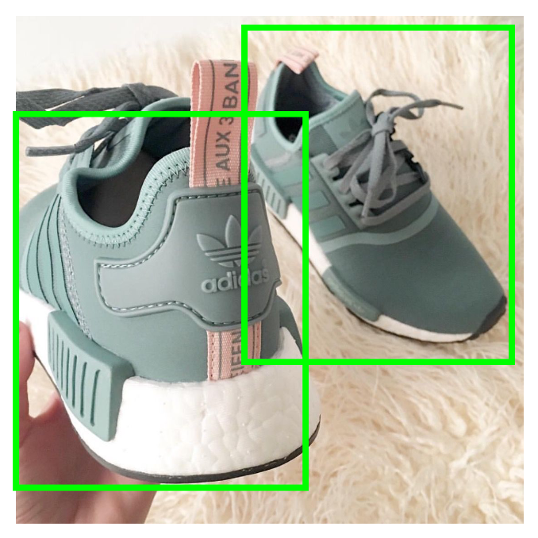

#  Swift Aveiro 2018 - Detecting objects with Core ML and Vision 

Welcome to *Detecting objects with Core ML and Vision* 🎉👁 👟

The goal of this workshop is to give you a practical intuition of how to leverage machine learning in a mobile app. 
After today you should be unafraid of adventuring yourself with Core ML, Vision and Turi Create.

This workshop is divided in 2 parts:

1. Exercise - Programming steps that will complete an app that detects sneakers 👟. You should be able to complete these steps after 1 hour.
2. Model training walk-through - Presentation of the path chosen to create and train the sneakers detection model used in our app.

##  🏁 Please start with:
1. Download the SneakersDetector.mlmodel from <https://github.com/andremontenegrof/SwiftAveiro-SneakersDetector-Models/blob/master/SneakersDetector.mlmodel>
2. Download this repo as a zip file and open /SneakersDetector/SneakersDetector.xcodeproj/

## 💻 Exercise
In ObjectDetector.swift you should find [9 steps to complete](exercise.md). You just need to search for "Mark:- Step" in the code. After completing all the steps, your app should be able to  recognise sneakers like in the following image:

<p align="center">

</p>


After completing the exercise, you can try the app in the ```liveCamera``` mode by tweaking the ```application(_, didFinishLaunchingWithOptions:)```

##  👟📚📈 Model training walk-through
Please open [Walk-through of the creation and training of our sneakers detector](walkthrough.md)